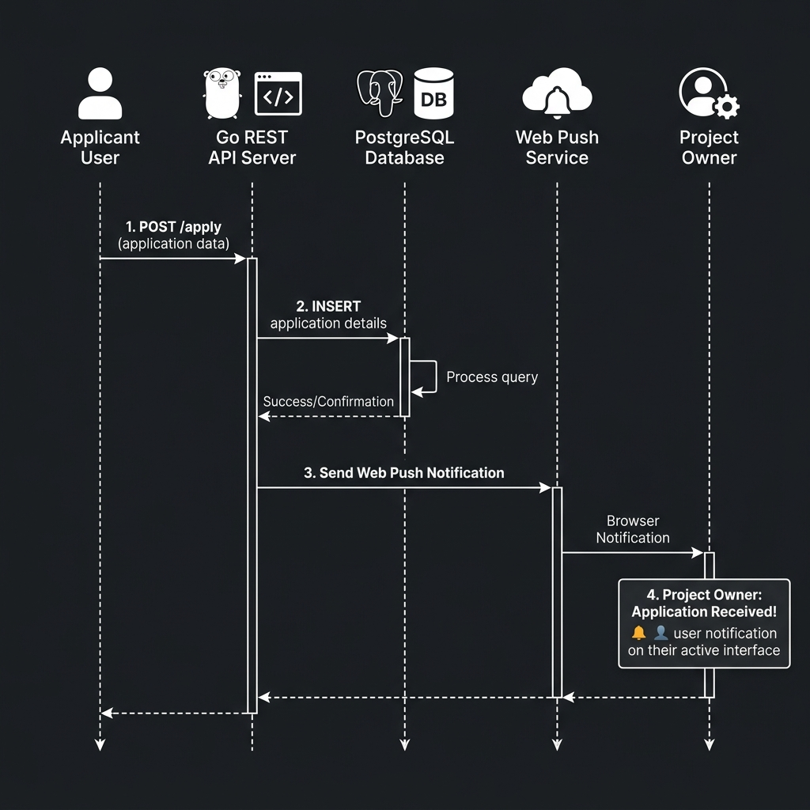
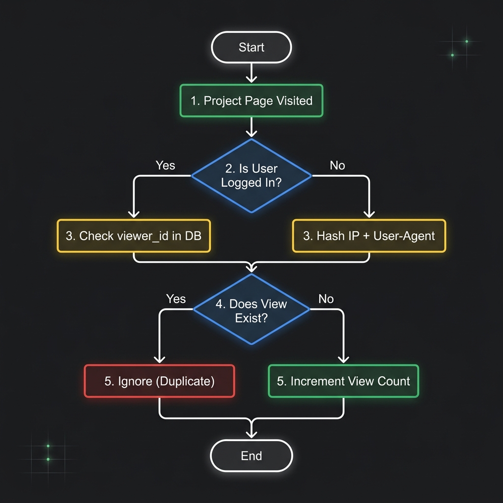
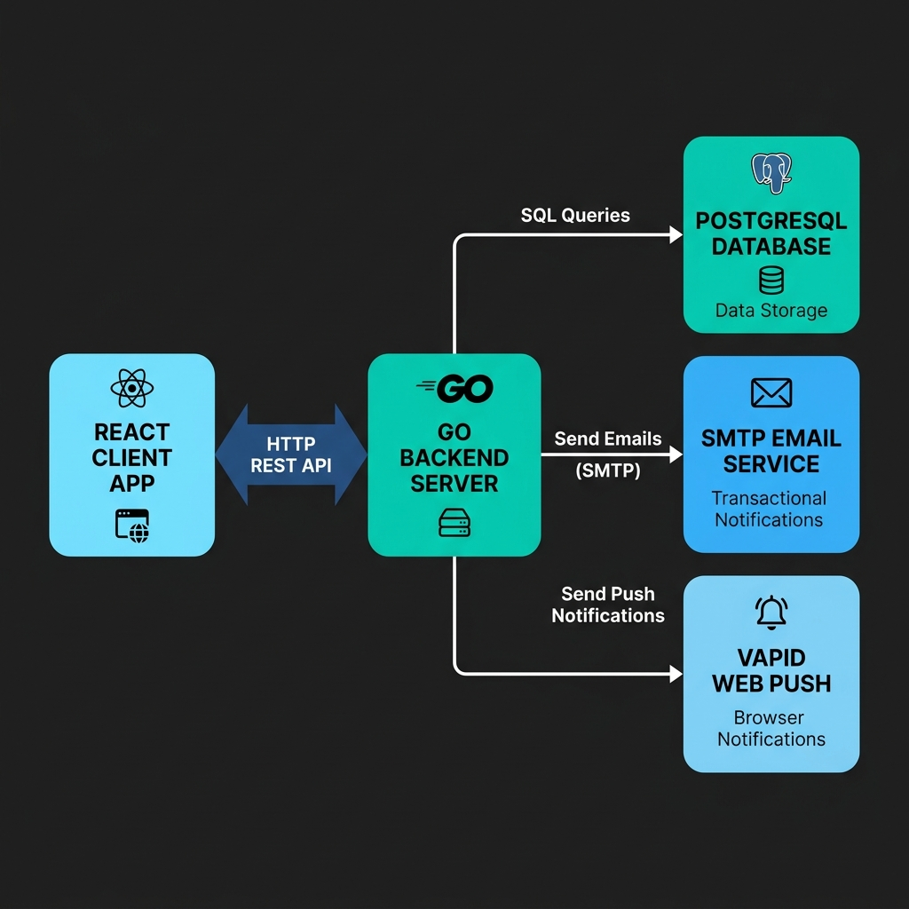

# Nucla

Nucla is a platform designed to connect startup founders with potential co-founders, developers, designers, and other key team members. The project simplifies the process of creating startup concepts, posting open roles, and coordinating applications, allowing early-stage teams to form and collaborate.

## Project Concept and Features

The platform focuses on early-stage startup collaboration, emphasizing quick discovery and high-quality match-making.

### User Profiles
Each user maintains a professional profile that lists their bio, current professional title, specific skill tags, and contact links (such as GitHub and Telegram). Users can also toggle their status to indicate whether they are open to offers.

### Project Directory and Creation
Founders can publish detailed project cards that describe their product concept, market category, location, current stage of development, and external links. 

### Role Openings and Applications
Projects define specific roles needed in the team. Users can apply to these open roles by submitting a cover letter. The application triggers system notifications, and its status is updated dynamically.

#### Application and Notification Flow

### Direct Messaging and Comments
The platform includes thread-based messaging systems and discussion boards under projects, allowing prospective team members to negotiate and discuss details directly on-platform.

### Uniqueness Verification for Project Views
To maintain accurate performance metrics, project views are tracked using two distinct mechanisms to filter duplicates:

This prevents multiple page refreshes from artificially inflating view counts without storing sensitive personal data.

### Admin Operations and SVG Analytics
Administrators access a dashboard to manage platform health:
- Moderation tools to ban users, delete spam posts, and hide projects.
- Broadcast systems to send HTML-formatted newsletters to all registered users.
- Analytical charts detailing daily user registrations, project creations, and sent email logs over the trailing 7 days. These charts are rendered as inline SVG graphics to remain lightweight and highly performant.

---

## Technical Architecture

The application is split into a Go-based REST API backend and a Vite-compiled React Single Page Application (SPA) frontend.

### System Diagram

### Backend Architecture
The backend is built as a compiled Go binary optimized for speed and low resource usage:
- **Router:** Routing is handled using the Chi router, providing a middleware-friendly REST handler chain.
- **Database Access:** PostgreSQL is utilized via the `pgx` driver and `pgxpool` connection pool for concurrent safety and query optimization.
- **Embedded Migrations:** Database migrations are stored as SQL files and compiled directly into the Go executable via `go:embed`. Migrations are checked and applied on server startup.
- **Authentication:** Handled using JSON Web Tokens (JWT) stored in secure, HTTP-only cookies to protect sessions from cross-site scripting (XSS) attacks.
- **Account Linking:** Supports automatic linking of Google OAuth 2.0 logins with existing email/password records if the email addresses match, avoiding unique constraint violations.

### Frontend Architecture
The frontend is built as a modern, reactive user interface:
- **State Management:** Handled by TanStack React Query. This manages data fetching, local cache invalidations, and optimistic updates when users make changes (e.g., bookmarking a project or updating profiles).
- **Styling System:** Implemented via standard CSS variables and tokens in a central stylesheets system (`index.css`). It dynamically handles light and dark mode switches using the `[data-theme]` attribute.
- **Code Optimization:** Implemented through code-splitting and asset compression configuration during the Vite build process.

---

## Deployment Architecture

The application is deployed using Docker containers orchestrated by Docker Compose, with Caddy acting as the entry point and automated playbooks handling updates.

### Container Orchestration
The multi-container setup consists of the following services:
- **Caddy Web Server:** Serves as the primary entry point on ports 80/443, automatically handling HTTPS Let's Encrypt certificates. It routes API requests (`/api/*`) to the backend and serves the compiled React assets for all other routes.
- **Frontend Container:** Houses the static production build of the React client served via Nginx or equivalent server inside the container.
- **Backend Container:** Runs the compiled Go executable. Migrations are executed on launch before the HTTP server starts listening.
- **Database (PostgreSQL 15):** Persistent data storage using Docker volumes (`db_data`), configured with a healthcheck check ensuring database readiness before backend startup.

### Infrastructure Automation
Deployment updates and environment installations on target servers are orchestrated using Ansible playbooks, ensuring consistent server provisioning and simplified release processes.
